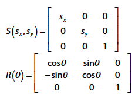
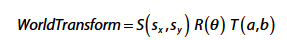

# OpenGL
注意，这一章讲的是Opengl在2D中的应用：stick with a z value of zero

## Window = SDL + GLEW

SDL renderer supports 2D graphics, it does not support 3D.
Need to remove all references to `SDL_Renderer`

```
  // Use the core OpenGL profile
  SDL_GL_SetAttribute(SDL_GL_CONTEXT_PROFILE_MASK,
  SDL_GL_CONTEXT_PROFILE_CORE);
  // Specify version 3.3
  SDL_GL_SetAttribute(SDL_GL_CONTEXT_MAJOR_VERSION, 3);
  SDL_GL_SetAttribute(SDL_GL_CONTEXT_MINOR_VERSION, 3);
  // Request a color buffer with 8-bits per RGBA channel
  SDL_GL_SetAttribute(SDL_GL_RED_SIZE, 8);
  SDL_GL_SetAttribute(SDL_GL_GREEN_SIZE, 8);
  SDL_GL_SetAttribute(SDL_GL_BLUE_SIZE, 8);
  SDL_GL_SetAttribute(SDL_GL_ALPHA_SIZE, 8);
  // Enable double buffering
  SDL_GL_SetAttribute(SDL_GL_DOUBLEBUFFER, 1);
  // Force OpenGL to use hardware acceleration
  SDL_GL_SetAttribute(SDL_GL_ACCELERATED_VISUAL, 1);


  mWindow = SDL_CreateWindow("Game Programming in C++ (Chapter 5)", 100, 100,
  1024, 768, SDL_WINDOW_OPENGL);
```

Rending a frame
```
  // Set the clear color to gray
  glClearColor(0.86f, 0.86f, 0.86f, 1.0f);
  // Clear the color buffer
  glClear(GL_COLOR_BUFFER_BIT);
  // TODO: Draw the scene
  // Swap the buffers, which also displays the scene
  SDL_GL_SwapWindow(mWindow);
```

OpenGL supports backward compatibility with an extension system. 
Normally, you must query any extensions you want manually, which is tedious. 
To simplify this process, you can use an open source library called the OpenGL Extension Wrangler Library (GLEW).

## Triangle (Why, How)

2D games use triangles to represent sprites by drawing a rectangle and filling in the rectangle
with colors from an image file.

### Normalized Device Coordinates
Normalized device coordinates (NDC) is the default coordinate system used with OpenGL.


### Vertex and Index Buffers
The solution to the duplicate data: 
1. create a vertex buffer that contains only the unique coordinates used by the 3D geometry. 
2. specify the vertices of each triangle, you index into this vertex buffer (much like indexing into an array).
```
  float vertexBuffer[] = {
    -0.5f, 0.5f, 0.0f, // vertex 0
    0.5f, 0.5f, 0.0f, // vertex 1
    0.5f, -0.5f, 0.0f, // vertex 2
    -0.5f, -0.5f, 0.0f // vertex 3
  };
  unsigned short indexBuffer[] = {
    0, 1, 2,
    2, 3, 0
  };
```
the first triangle has the vertices 0, 1, and 2
the vertex/index buffer combination uses 12 × 4 + 6 × 2 = 60 bytes

If save all vertex, need 18 * 4 = 72 bytes
```
  float vertices[] = {
    -0.5f, 0.5f, 0.0f,
    0.5f, 0.5f, 0.0f,
    0.5f, -0.5f, 0.0f,
    0.5f, -0.5f, 0.0f,
    -0.5f, -0.5f, 0.0f,
    -0.5f, 0.5f, 0.0f,
    };
```


OpenGL uses a vertex array object to encapsulate a vertex buffer, an index buffer, and the vertex layout.

```
class VertexArray
{
  public:
    // 核心函数只有这一个
    VertexArray(const float* verts, unsigned int numVerts, const unsigned int* indices, unsigned int numIndices);
    ~VertexArray();

    // Activate this vertex array (so we can draw it)
    void SetActive();
    unsigned int GetNumIndices() const { return mNumIndices; }
    unsigned int GetNumVerts() const { return mNumVerts; }

  private:
    // How many vertices in the vertex buffer?
    unsigned int mNumVerts;
    // How many indices in the index buffer
    unsigned int mNumIndices;
    // OpenGL ID of the vertex buffer
    unsigned int mVertexBuffer;
    // OpenGL ID of the index buffer
    unsigned int mIndexBuffer;
    // OpenGL ID of the vertex array object
    unsigned int mVertexArray;
  };
```

Keep in mind that the ID numbers are `not unique` across different types of objects. 
It’s therefore very possible to have an ID of 1 for both the vertex and index buffers because OpenGL considers them different
types of objects.

1. create the vertex array object and store its ID in the mVertexArray member variable:
```
  glGenVertexArrays(1, &mVertexArray);
  glBindVertexArray(mVertexArray);
```
2. create a vertex buffer:
```
  glGenBuffers(1, &mVertexBuffer);
  glBindBuffer(GL_ARRAY_BUFFER, mVertexBuffer);
```
3. copy the verts data to vertex buffer
```
  glBufferData(
    GL_ARRAY_BUFFER,               // The active buffer type (NOT the object ID) to write to
    numVerts * 3 * sizeof(float),  // Number of bytes to copy
    verts,                         // Source to copy from (pointer)
    GL_STATIC_DRAW                 // How will we use this data?
  );
```
GL_STATIC_DRAW means you only want to load the data once and use it frequently for drawing.

4. Create index buffer
```
  glGenBuffers(1, &mIndexBuffer);
  glBindBuffer(GL_ELEMENT_ARRAY_BUFFER, mIndexBuffer);
```
5. copy the indices data into the index buffer:
```
  glBufferData(
    GL_ELEMENT_ARRAY_BUFFER, // Index buffer
    numIndices * sizeof(unsigned int), // Size of data
    indices, 
    GL_STATIC_DRAW
  );
```

6. specify a vertex layout, also called the vertex attributes
```
  glVertexAttribPointer(
    0,         // Attribute index (0 for first one)
    3,         // Number of components (3 in this case)
    GL_FLOAT,  // Type of the components
    GL_FALSE,  // (Only used for integral types)
    sizeof(float) * 3, // Stride (usually size of each vertex)
    0                  // Offset from start of vertex to this attribute
  );
```

## Shaders
Vertex Shaders : runs once for every vertex of every triangle drawn.


Fragment Shaders : After the vertices of a triangle have gone through the vertex shader, OpenGL must determine
which pixels in the color buffer correspond to the triangle.

w component

## Transformation Basics

- Object Space / model space 
   the positions are relative to an arbitrary origin of the object itself.


- World Space : 
This coordinate space, called world space, has its own origin and basis vectors

- Transforming to World Space
When transforming between coordinate spaces, you need to know


## Matrices and Transformations

- Translation Matrices
You can represent 2D scale and rotation matrices with 2×2 matrices. 
However, there’s no way to write a generic 2D translation matrix of size 2×2. 
The only way to express the translation T(a,b) is with a 3×3 matrix.

However, you can’t multiply a 1×2 matrix representing a point by a 3×3 matrix 
because the the 1×2 matrix doesn’t have enough columns.

Homogenous coordinates use n+1 components to represent an n-dimensional space. 
So, for a 2D space, homogeneous coordinates use three components.






You can then pass this world transform matrix to the
vertex shader and use it to transform every vertex of an object by its world transform matrix.

## Texture Mapping
you need to know which parts of the texture should correspond to which triangles.

To support this, you need an additional vertex attribute for every vertex in the vertex buffer.
Previously, the vertex attributes only stored a 3D position in each vertex. For texture mapping,
each vertex also needs a texture coordinate that specifies the location in the texture that corresponds
to that vertex.


