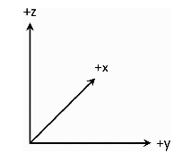
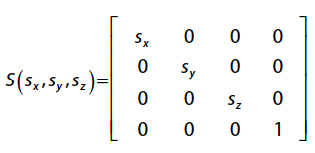
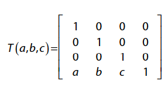

In 3D game position is Vector3

This book use left-handed coordinate system


## Transform Matrices for 3D
3D coordinates, the translation matrices become 4*4 matrices

Scale matrix



Translation matrix



## 3D Roation
in 2D an actor only needed one float for rotation about z-axis

3D, it’s valid to rotate about `any` of the three coordinate axes.

One approach for 3D rotations is Euler angles, where there are three angles (yaw, pitch, and
roll) representing rotation about each axis.

Yaw is a rotation about the up axis, 
pitch is a rotation about the side axis, 
and roll is a rotation about the forward axis.


## Quaternions
quaternion as a method to represent a rotation about an arbitrary axis (not just x, y, or z).
为了表示旋转，至少需要 旋转了多少度 和 向哪个方向旋转 
quaternion 由向量和角度构成

unit quaternions, which are quaternions with a magnitude of one

### Compute quaternion 
Initially, the ship is at position S with an initial facing down the x-axis. 
Say that you want to rotate the ship to instead face an arbitrary point P.
1. compute the vector from the ship to the new point and normalize
this vector

2. compute the axis of rotation between the original facing and the new facing, using the `cross product`, and normalize this vector

3. Then compute the angle of rotation using the `dot product` and `arccosine`

4. plug in this axis and angle to create the quaternion representing the rotation of the ship

One edge case is that if NewFacing is parallel to the original facing, the cross product yields a vector of all zeros


### Combining rotation
Given two quaternions, p and q, the Grassmann product is the rotation of q followed by p:


### Rotating a Vector by a Quaternion

To rotate a 3D vector, v, by a quaternion, 
1. represent v as the following quaternion, r:

2. compute r′ with two Grassmann products:

The rotated vector is then simply the vector component of r′


### Spherical Linear Interpolation
Quaternions support a more accurate form of interpolation called `spherical linear interpolation`

The Slerp equation takes in two quaternions, a and b, as well as the fractional value in the range [0, 1]

### Quaternion-to-Rotation Matrix
you need to eventually convert the quaternion rotation into a world transform matrix.


## Transform 
```
  // Scale, then rotate, then translate
  mWorldTransform = Matrix4::CreateScale(mScale);
  mWorldTransform *= Matrix4::CreateFromQuaternion(mRotation);
  mWorldTransform *= Matrix4::CreateTranslation(mPosition);
```

Rotate about Z axis
```
  void MoveComponent::Update(float deltaTime)
  {
    if (!Math::NearZero(mAngularSpeed))
    {
      Quaternion rot = mOwner->GetRotation();
      float angle = mAngularSpeed * deltaTime;

      // Create quaternion for incremental rotation
      // (Rotate about Z axis)
      Quaternion inc(Vector3::UnitZ, angle);
      
      // Concatenate old and new quaternion
      rot = Quaternion::Concatenate(rot, inc);
      mOwner->SetRotation(rot);
    }
    // Updating position based on forward speed stays the same
    // ...
  }
```

## Loading 3D model
For 2D games, every sprite draws with a single quad, which means it’s okay to hard-code the vertex and index buffers.

3D game then needs code to load these models into vertex and index buffers.

File format

```
class Mesh
{
  // Load/unload mesh
  bool Load(const std::string& fileName, class Game* game);
}
```

## Drawing 3D Meshes
Splict the function into Renderer from Game

The Game class then constructs and initializes an instance of Renderer in Game::Initialize

Game::GenerateOutput calls renderer.Draw()

### View Matrix
The view matrix represents the position and orientation of the camera, or “eye” in the world.

A quick way to make the camera move is to create an `actor` for the camera.

```
  // Location of camera
  Vector3 eye = mCameraActor->GetPosition();

  // Point 10 units in front of camera
  Vector3 target = mCameraActor->GetPosition() +
  mCameraActor->GetForward() * 10.0f;

  Matrix4 view = Matrix4::CreateLookAt(eye, target, Vector3::UnitZ);
```


### Projection Matrix
The projection matrix determines how the 3D world flattens into the 2D world drawn
onscreen.

- In an orthographic projection, objects farther away from the camera are the same
size as objects closer to the camera

- In a perspective projection, objects farther away from the camera are smaller than closer
ones.

ViewProjection = (View)(Projection)

vertex shader uses this view-projection matrix to transform vertex positions from
world space into clip space.

## Z-Buffer
painter’s algorithm draws objects from back to front. 3D games do not use the painter’s algorithm
for most objects.

you clear each pixel to the maximum depth value in normalized device coordinates, which is 1.0.
```
  Z-Buffering Pseudocode
  // zBuffer[x][y] grabs depth at that pixel
  foreach MeshComponent m in scene
    foreach Pixel p in m
      float depth = p.Depth()
      if zBuffer[p.x][p.y] < depth
        p.draw
      endif
    endfor
  endfor
```

OpenGL supports depth buffering with minimal effort

request a depth buffer (24-bit is a typical size):
```
SDL_GL_SetAttribute(SDL_GL_DEPTH_SIZE, 24);
```
enables depth buffering:
```
glEnable(GL_DEPTH_TEST);
```

sprite rendering uses alpha blending to support textures with transparency. Because this doesn’t play
nicely with z-buffering, you must disable alpha blending for 3D objects and then reenable it for
sprites. Likewise, sprites must render with z-buffering disabled.

This naturally leads to rendering in two phases: 
1. render all 3D objects with alpha blending disabled and z-buffering enabled.
2. render all sprites with alpha blending enabled and z-buffering disabled. 
```
  // Enable depth buffering/disable alpha blend
  glEnable(GL_DEPTH_TEST);
  glDisable(GL_BLEND);
```

Unlike SpriteComponent, MeshComponent does not have a draw order variable. 
This is because the order doesn’t matter because 3D meshes use z-buffering


## Light
- Ambient and directional lights affect the entire scene,
- point and spotlights affect only certain areas. 

One method to approximate how light affects the scene is the Phong reflection model. 
The Phong model has three components:
ambient, diffuse, and specular.

